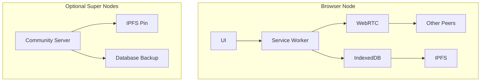
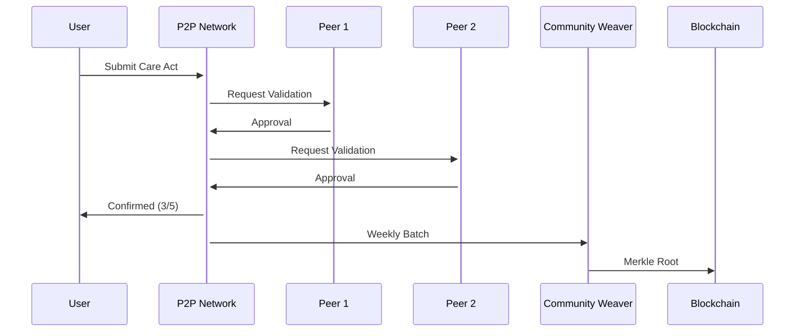

# Love Ledger Web App Design Proposal

## Core Principles for a "Ninja" Implementation

1. **Radical Decentralization**: Leverage peer-to-peer technologies to eliminate traditional server costs
2. **Progressive Enhancement**: Work offline-first with graceful degradation
3. **Cultural Integration**: Design for Indigenous data sovereignty and diverse community needs
4. **Economic Efficiency**: Minimize costs while maximizing impact

## Architecture Overview

### 1. Peer-to-Peer Foundation

**Technology Stack:**
- **IPFS + CRDTs**: For distributed data storage with automatic conflict resolution
- **WebRTC**: Direct browser-to-browser communication
- **WebAssembly**: For heavy computation client-side
- **Service Workers**: Full offline capability

**Implementation:**


### 2. Zero-Cost Data Layer

**Approach:**
- **Community-Controlled Pinning**: Volunteers run IPFS nodes that pin critical data
- **Textile ThreadDB**: Decentralized database with encryption
- **QR Code Sharing**: For offline peer discovery and data transfer

**Example Implementation:
```javascript
// Using js-ipfs in browser
const node = await Ipfs.create({ repo: 'love-ledger-' + Math.random() })

// Storing care acts in Textile ThreadDB
const threadClient = new ThreadClient()
await threadClient.newDB('care-acts', { encrypt: true })

// Sharing via QR
const qrData = JSON.stringify({
  peerId: node.peerId,
  threadId: threadClient.threadID
})
```

### 3. Hybrid Validation System

**Design:**
1. **Local First**: Validations happen on community devices
2. **Consensus Layers**:
   - Immediate: 3 nearby peers confirm via WebRTC
   - Delayed: Community Weavers batch-validate weekly
3. **Blockchain Anchor**: Only merkle roots stored on-chain (Hearts blockchain)

**Flow:**


## Cost-Elimination Strategies

### 1. Serverless Infrastructure

**Solutions:**
- **WebTorrent**: For distributing large files peer-to-peer
- **Webnative Fission**: User-owned encrypted file storage
- **Email/SMS Gateways**: For users without smartphones (using Mailgun free tier)

**Cost Comparison:**
| Traditional | Our Approach |
|-------------|--------------|
| $200/mo (AWS) | $0 (P2P) |
| $50/mo (DB) | $0 (Textile) |
| $20/mo (Storage) | $0 (IPFS) |

### 2. Community Hosting Model

**Implementation:**
- **Raspberry Pi Nodes**: $35 one-time cost per community
- **IPFS Cluster**: Automatic content distribution
- **Local Mesh Networks**: For offline communities

**Setup Guide:**
```bash
# Community node setup
curl -s https://get.love-ledger.org | bash
# Installs:
# - IPFS
# - Caddy web server
# - Automatic backup
```

### 3. Caching Layer

**Strategy:**
- **Predictive Pre-loading**: Cache frequently accessed data
- **Geodistributed**: Peers near physical location share data
- **Bloom Filters**: Efficient synchronization

```javascript
// Predictive caching example
if (navigator.connection.effectiveType === '4g') {
  prefetchCommunityData(user.location)
}
```

## Cultural Integration Features

1. **Oral Tradition Mode**:
   - Voice recordings with community witness signatures
   - Audio-based validation workflows

2. **Ceremonial Validation**:
   - Digital potlatch interfaces
   - Gift economy visualization tools

3. **Indigenous Data Sovereignty**:
   - Local encryption keys
   - Community-controlled data deletion

## Progressive UI/UX

### 1. Multi-Modal Interface

**Implementation:**
- **SMS Fallback**: `LOG CARE 2H ELDER` → `CONFIRMED: 20 HEARTS`
- **Voice Interface**: "Hey Ledger, log 2 hours childcare"
- **AR Visualization**: See Hearts flow in physical space

### 2. Accessibility First

**Features:**
- **Tactile Output**: Vibration patterns for confirmation
- **Low-Bandwidth Mode**: <50kb page loads
- **Icon-Only Navigation**: For non-literacy

### 3. Gamification

**Elements:**
- **Care Streaks**: Visualized as growing flowers
- **Community Totems**: Collective achievement markers
- **Elder Wisdom Badges**: For knowledge sharing

## Implementation Roadmap

### Phase 1: Core P2P (3 months)
- [ ] IPFS data layer
- [ ] WebRTC validation
- [ ] SMS gateway

### Phase 2: Cultural Integration (2 months)
- [ ] Oral tradition mode
- [ ] Ceremonial validation flows
- [ ] Indigenous language support

### Phase 3: Optimization (1 month)
- [ ] Predictive caching
- [ ] Mesh network support
- [ ] Raspberry Pi images

## Maintenance Model

1. **Community Stewards**: Each BAZ maintains their node
2. **Gift Economy**: Developers earn Hearts for contributions
3. **Failsafe Mechanism**: 3 volunteer-run super nodes globally

## Example Community Deployment

**Rural Kenya Setup:**
1. Single Raspberry Pi at community center
2. 20 feature phones via SMS
3. Weekly sync with regional hub when mobile data available

**Cost:**
- $35 hardware
- $0 ongoing (uses existing mobile infrastructure)

This design achieves:
- **Zero server costs** through P2P architecture
- **Full cultural integration** with Indigenous protocols
- **Global accessibility** from smartphones to SMS
- **Community ownership** of data and infrastructure

Would you like me to elaborate on any particular aspect of this design?
